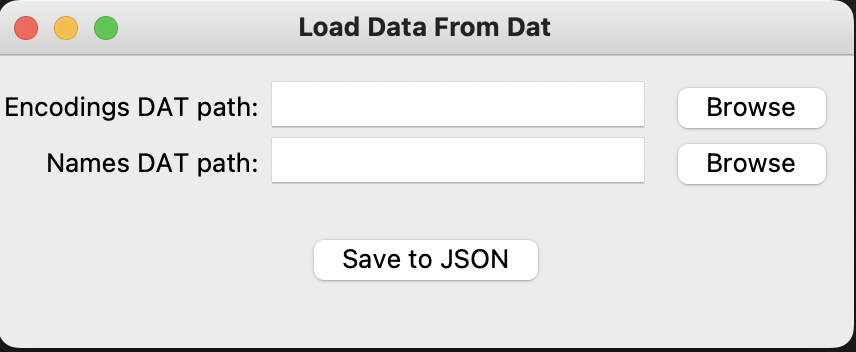

<h1 align="center">Script for HashDB
</h1>
<p align="center">
  
</p>
<hr/>

## ⚙️ Setup
create a conda virtual env
`conda create -n ENV_NAME python=3.10`, then

```
conda activate ENV_NAME

conda install pybind11 -c conda-forge -y 

in clockin-dat-utils pip install -e . 

python dat_utils.py ENCODING_DAT_PATH 

NAMES_DAT_PATH

Example: python dat_utils.py /Users/gustavoabell/Desktop/hashdb-dat/face_descriptors_jittered.dat /Users/gustavoabell/Desktop/hashdb-dat/face_names_jittered.dat

Remember Install cmake.
```

A json file named `data.json` will be written in the format:

```
[
  {
    "id": "1313_Jansel Valentin",
    "descriptor": [
      -0.09853, 0.14999, 0.0633885, 0.0326677, -0.00369446, -0.120047,
      0.0211906, -0.102562, 0.138737, -0.0697453, 0.245993, -0.0391698,
      -0.169799, -0.085542, 0.0700775, 0.141677, -0.19106, -0.0559553,
      -0.056682, -0.0632841, 0.024643, 0.0109849, 0.0386512, 0.0708515,
      -0.020673, -0.351868, -0.134582, -0.131169, 0.0767037, -0.0864054,
      -0.00775184, .....
``` 

A visual user interface can be used instead:
run `python gui.py` . The following screen will appear:



## 🤝 Contributors

Made with ❤️ by:
<table>
<tbody>
  <tr>
  <td align="center">
      <a href="#">
        <br>
        <sub>
          <b>Léo Dias</b>
        </sub>
      </a>
    </td>
  <td align="center">
      <a href="#">
        <br>
        <sub>
          <b>Gustavo Abel</b>
        </sub>
      </a>
    </td>
    </tr>
  </tbody>
</table>
